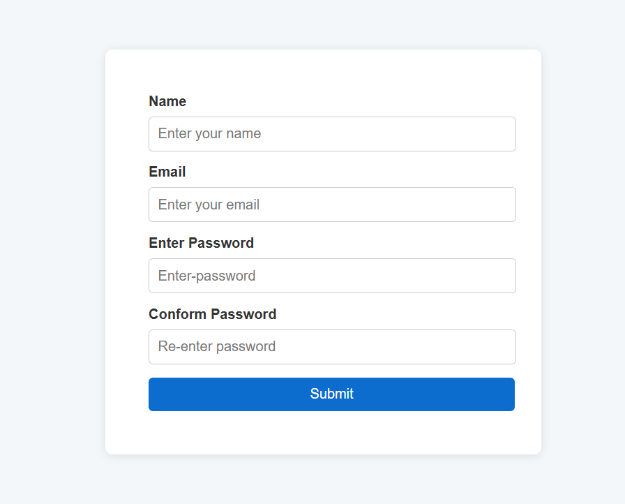

<!-- Auto-updated README -->
_Last updated: 2026-03-06_


## **Form Validator and Submission Project**

### **Overview**
This project is a simple **Form Validator** built with **HTML**, **CSS**, and **JavaScript**. It includes real-time validation for user input fields like name, email, and password, ensuring valid data before allowing form submission. Once the form is successfully submitted, the user is redirected to a new page (`success.html`), where their submitted details are displayed.

### **Features**
- Real-time input validation for:
  - Name (minimum 3 characters)
  - Email (valid email format)
  - Password (minimum 8 characters)
  - Confirm Password (must match the first password)
- Submit button is disabled until all fields are valid.
- On successful submission, data is saved to **localStorage** and displayed on a new page.

---

### **Technologies Used**
- **HTML5**  
- **CSS3**  
- **Vanilla JavaScript**

---

### **How to Run the Project**

1. **Clone the Repository** (or download the project folder):
   ```bash
   git clone https://github.com/your-repo/form-validator-project.git
   ```

2. **Open the Project:**
   - Open `index.html` in your browser.
   - This will load the form validation page.

3. **Fill out the form:**
   - Enter a valid name (at least 3 characters).  
   - Enter a valid email (e.g., `example@mail.com`).  
   - Enter a password with a minimum of 8 characters.  
   - Confirm the password (must match the first one).

4. **Submit the Form:**  
   - If all fields are valid, you will be redirected to `success.html`, which displays the submitted details.

---

### **File Structure**
```
/project-root
│
├── index.html       # Main form page
├── success.html     # Page to display submitted details
├── style.css        # Styling for the form and success page
├── app.js           # JavaScript for form validation and handling submission
└── README.md        # Project documentation
```

---

### **How It Works**
1. **Real-Time Validation:**  
   Each input field listens for user input and validates it using regular expressions (`regex`). Errors are shown if the input is invalid.

2. **localStorage Usage:**  
   On form submission, the form data is saved in `localStorage` as a JSON string.

3. **Display Data on Success Page:**  
   The success page reads the data from `localStorage` and displays the user's name and email.

---

### **Future Improvements**
- Add phone number validation.  
- Add animations for form transitions.  
- Integrate a backend server for data persistence.  
- Improve mobile responsiveness with media queries.

---

### **Screenshots**
_Example screenshot placeholders—replace with actual images if needed._



---

### **License**
This project is free to use and modify. No license required.

---

